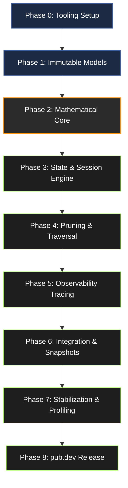

# BranchIQ v0.1.0: Implementation Plan Specification
**Version**: 0.1.0-impl  
**Author**: Technical Execution Lead & Systems Architect  
**Status**: Frozen for Development  

---

# 1. Implementation Philosophy

In runtime systems engineering, the sequence of development is as critical as the correctness of the code itself. Without strict sequencing, developers build high-level algorithms on top of untested abstractions, leading to fragile integrations, circular dependencies, and bugs that are difficult to isolate.

Deterministic decision runtimes require strict implementation discipline. BranchIQ v0.1.0 prioritizes stability and reproducibility over feature count. Every module must be implemented, tested, and validated in isolation before it is integrated into the orchestrator. The delivery of a minimal, highly stable MVP is the primary objective of this roadmap.

Our execution strategy is guided by a single rule:

> **“Build the smallest stable deterministic engine first.”**

To achieve this, we enforce:
1. **Unidirectional Execution Order**: Abstractions must be built from the bottom up. We implement the mathematical primitives and data models first, then move on to pruning filters, path traversals, and finally the execution orchestrator.
2. **Defensive Testing Boundaries**: No high-level integration testing is performed until the unit tests of all underlying modules pass with 100% code coverage.
3. **Overengineering Prevention**: Advanced runtime systems—such as background isolates, dynamic database caching, and adaptive machine-learning models—are strictly deferred. 

---

## Implementation Section Checklist

- [ ] implementation order clearly defined
- [ ] dependency sequencing enforced
- [ ] architecture stability protected
- [ ] overengineering risks addressed
- [ ] MVP constraints enforced

---

# 2. High-Level Development Roadmap

To transition BranchIQ from a design specification to a pub.dev-ready release, development is structured into nine sequential phases.

## 2.1 Implementation Phase Schedule

| Phase | Goal | Focus Area | Entry Conditions | Exit Conditions |
|:---|:---|:---|:---|:---|
| **Phase 0** | Tooling & Infrastructure | Repo initialization, analysis rules, CI configuration, SDK boundaries. | Frozen design documents. | CI validates analysis & empty test runners. |
| **Phase 1** | Core Models | Immutable node/tree schemas, configuration classes, context objects. | Phase 0 complete. | Const models written; JSON serialization verified. |
| **Phase 2** | Mathematical Core | Normalization models, sanitizers, decay propagation, utility scores. | Phase 1 passing models. | Math functions compile; unit test coverage hits 100%. |
| **Phase 3** | Runtime Execution Engine | Execution session state, pipeline runner interface, circuit breakers. | Phase 2 passing math. | Pipeline orchestrator executes mock trees. |
| **Phase 4** | Pruning & Traversal | Beam search filters, probability pruners, $A^*$ priority pathfinder. | Phase 3 engine framework. | Path finder extracts optimal path deterministically. |
| **Phase 5** | Debugging & Observability | Tracing buffers, explanation generators, JSON snapshooters. | Phase 4 stable search. | Tracing compiled out in release; logs in debug. |
| **Phase 6** | Testing & Regression | End-to-end integration, regression snapshot testing. | Phase 5 tracing active. | Integrations verify determinism across 10,000 runs. |
| **Phase 7** | Package Stabilization | CPU/memory profiling, API freeze, cleanup. | Phase 6 tests complete. | Allocations minimized; public API frozen. |
| **Phase 8** | pub.dev Release Prep | Documentation comments, example apps, pubspec tags. | Phase 7 frozen engine. | Pub.dev publisher dry-run succeeds with 140/140 points. |

## 2.2 Sequence Rationale
Ordering the implementation in this way prevents architectural regression. By completing Phase 1 and Phase 2 first, we establish a stable, mathematically sound type system. The runtime engine (Phase 3) and search algorithms (Phase 4) can then consume these types without needing to change data schemas mid-development.

---

## Implementation Section Checklist

- [ ] implementation order clearly defined
- [ ] dependency sequencing enforced
- [ ] architecture stability protected
- [ ] overengineering risks addressed
- [ ] MVP constraints enforced

---

# 3. Repository Initialization Plan

BranchIQ enforces a structured development environment to ensure that changes do not break architectural constraints.

## 3.1 Branching Strategy and Git Conventions
*   **Trunk-Based Development**: Developers push feature branches and merge them into the `main` branch via Pull Requests. Direct commits to `main` are prohibited.
*   **Commit Message Discipline**: Commit titles must follow the conventional commits standard:
    *   `feat(core):` for new core engine capabilities.
    *   `fix(math):` for bug fixes in calculation modules.
    *   `docs(core):` for changes to planning or specifications files.
    *   `test(unit):` for new test cases.

## 3.2 Continuous Integration & Documentation Rules
*   **Protected Branch**: The `main` branch is protected. Merging requires a passing CI run (no analysis warnings, all tests pass).
*   **Documentation Sync**: If an implementation detail deviates from the specification files in `docs/core/`, the developer must open a documentation-update RFC *before* the code pull request is approved. The specifications are the source of truth.

---

## Implementation Section Checklist

- [ ] implementation order clearly defined
- [ ] dependency sequencing enforced
- [ ] architecture stability protected
- [ ] overengineering risks addressed
- [ ] MVP constraints enforced

---

# 4. Phase 0 — Tooling & Infrastructure

Phase 0 sets up the compiler boundaries, linter parameters, and continuous integration pipelines.

## 4.1 Configuration Files Setup

### 4.1.1 SDK Constraints (`pubspec.yaml`)
We target the latest stable pure Dart SDK, keeping it independent of the Flutter framework:
```yaml
environment:
  sdk: '>=3.0.0 <4.0.0'
```

### 4.1.2 Static Analysis rules (`analysis_options.yaml`)
To enforce strict type safety and code quality, we require:
```yaml
include: package:extra_pedantic/analysis_options.yaml

analyzer:
  language:
    strict-casts: true
    strict-inference: true
    strict-raw-types: true
  errors:
    missing_required_param: error
    missing_return: error
    todo: ignore

linter:
  rules:
    - avoid_dynamic_calls
    - prefer_const_constructors
    - public_member_api_docs
    - always_require_non_null_named_parameters
    - avoid_relative_lib_imports
```

## 4.2 Prohibited Infrastructures
*   **No Code Generation**: Running `build_runner` or using code generation tools (e.g., `freezed`, `json_serializable`) is prohibited inside core modules. Everything must be written in clean, hand-crafted Dart.
*   **No Reflection**: Using `dart:mirrors` is prohibited to ensure full compatibility with AoT compilation and dead-code tree-shaking.
*   **Minimal Dependencies**: No external helper libraries are allowed. The engine must compile using standard SDK imports.

---

## Implementation Section Checklist

- [ ] implementation order clearly defined
- [ ] dependency sequencing enforced
- [ ] architecture stability protected
- [ ] overengineering risks addressed
- [ ] MVP constraints enforced

---

# 5. Phase 1 — Core Models Implementation

This phase establishes the immutable data representations. The modules are implemented from leaf models to container models.

```
  ┌────────────────────────────────────────────────────────┐
  │ 1. Configuration Models (config/scoring_config.dart)   │
  └───────────────────────────┬────────────────────────────┘
                              ▼
  ┌────────────────────────────────────────────────────────┐
  │ 2. Leaf Model: DecisionNode (models/node.dart)         │
  └───────────────────────────┬────────────────────────────┘
                              ▼
  ┌────────────────────────────────────────────────────────┐
  │ 3. Container Model: DecisionTree (models/tree.dart)    │
  └───────────────────────────┬────────────────────────────┘
                              ▼
  ┌────────────────────────────────────────────────────────┐
  │ 4. Evaluation Models (result.dart, snapshot.dart)      │
  └────────────────────────────────────────────────────────┘
```

## 5.1 Implementation Steps
1.  **Configurations**: Implement `ScoringConfig`, `PruningConfig`, and `TraversalConfig` as immutable objects with validation assertions inside their constructors.
2.  **`DecisionNode`**: Implement as an immutable class with a `const` constructor, a `copyWith` method for copying states, and a `toJson()` serializer.
3.  **`DecisionTree`**: Implement as an immutable model wrapper around a flat registry map (`Map<String, DecisionNode>`).

## 5.2 Immutability and Serialization Verification
*   Tests in Phase 1 verify that `copyWith` returns distinct object instances and does not mutate variables in-place.
*   Serialization checks verify that serializing a tree to JSON and parsing it back yields identical values.
*   *Exclusions*: No evaluation states or algorithms are implemented in this phase.

---

## Implementation Section Checklist

- [ ] implementation order clearly defined
- [ ] dependency sequencing enforced
- [ ] architecture stability protected
- [ ] overengineering risks addressed
- [ ] MVP constraints enforced

---

# 6. Phase 2 — Mathematical Core

This phase implements the mathematical equations defined in [docs/core/mathematical_model.md](file:///Users/user/StudioProjects/BranchIQ/docs/core/mathematical_model.md).

## 6.1 Coding Order
1.  **Sanitization Primitives (`math/sanitize.dart`)**: Functions to clamp float values to boundaries and sanitize NaN and $\pm\infty$ values.
2.  **Cost Normalization (`math/cost.dart`)**: Implements cost clamping and linear normalization based on the configuration ceiling $C_{\text{max}}$.
3.  **Decay Propagation (`math/decay.dart`)**: Implements exponential confidence decay curves based on depth.
4.  **Utility Scoring (`scoring/maut.dart`)**: Combines confidence values with probability, cost, and impact parameters to compute utility scores:
    $$S(n) = K(n) \cdot \left[ w_p \cdot P(n) + w_i \cdot I(n) - w_c \cdot C_{\text{norm}}(n) \right]$$

## 6.2 Numerical Validation Strategy
*   **Precision and Boundary Tests**: Verify behavior using input extremes (e.g., NaN inputs, zero probabilities, negative costs, division-by-zero bounds).
*   **Tolerance Checks**: Validate that float results are compared using a delta value ($\delta = 10^{-6}$) rather than direct equality checks.

---

## Implementation Section Checklist

- [ ] implementation order clearly defined
- [ ] dependency sequencing enforced
- [ ] architecture stability protected
- [ ] overengineering risks addressed
- [ ] MVP constraints enforced

---

# 7. Phase 3 — Runtime Execution Engine

Phase 3 coordinates evaluations using state machines and execution loops.

## 7.1 Runtime State Machine Execution Order
1.  **State Definition (`runtime/state.dart`)**: Defines the engine's execution states using an enum:
    ```dart
    enum EvaluationState { idle, validating, expanding, scoring, pruning, traversing, completed, failed }
    ```
2.  **Evaluation Session (`runtime/session.dart`)**: Houses evaluation parameters, trace buffers, and circuit-breaker flags.
3.  **Orchestrator Pipeline (`core/engine.dart`)**: Coordinates operations, taking inputs and returning results.

## 7.2 Safety Check Implementations
*   **Cycle Validation**: The engine runs a Depth-First Search (DFS) check on initialization to detect structural loops in the tree and throws an `InvalidTreeException` if any are found.
*   **Size Guards**: If a tree violates size or depth limits ($N > 100$, depth $d > 4$), the engine halts execution and returns a default fallback path.

---

## Implementation Section Checklist

- [ ] implementation order clearly defined
- [ ] dependency sequencing enforced
- [ ] architecture stability protected
- [ ] overengineering risks addressed
- [ ] MVP constraints enforced

---

# 8. Phase 4 — Pruning & Traversal

This phase implements the branch filtering and pathfinding algorithms.

## 8.1 Implementation Sequence
1.  **Probability and Score Pruning (`pruning/probability.dart`, `pruning/score.dart`)**: Excludes nodes whose transition probability or aggregate utility score falls below thresholds.
2.  **Beam Search Pruning (`pruning/beam.dart`)**: Implements the active frontier filter, sorting sibling nodes and retaining only the top $k$ candidates.
3.  **A\* Pathfinder (`traversal/a_star.dart`)**: Implements the pathfinding traversal, searching the pruned tree to find the optimal path.
4.  **Path Backtracking (`traversal/backtrack.dart`)**: Traces parent pointers backwards from the chosen leaf node to reconstruct the final path.

```
  Scored Nodes ──► [ Probability Pruning ] ──► [ Beam Width Filter ] ──► [ A* Traversal ] ──► Best Path
```

## 8.2 Why Traversal is Implemented Last
The search traversal algorithm requires node values and tree structures to be finalized. Implementing traversal before pruning and scoring leads to coupling, making the codebase fragile. By waiting until Phase 4, the pathfinder can run on pre-scored, pre-pruned trees.

---

## Implementation Section Checklist

- [ ] implementation order clearly defined
- [ ] dependency sequencing enforced
- [ ] architecture stability protected
- [ ] overengineering risks addressed
- [ ] MVP constraints enforced

---

# 9. Phase 5 — Debugging & Observability

Phase 5 implements debugging and tracing systems.

## 9.1 Implementation Steps
1.  **`DebugTracer` (`debug/trace.dart`)**: A transient logging class that captures evaluation step metrics.
2.  **`SnapshotGenerator` (`debug/snapshot.dart`)**: Packages the execution tree state (including pruned branches) into a JSON snapshot.
3.  **Explanation Writer**: Converts trace files into a human-readable text explanation (e.g., *"Path chosen because network latency exceeded cache cost ceilings"*).

## 9.2 Debug Mode Isolation Rules
*   Observability systems are disabled by default.
*   In release builds, tracing code is omitted or bypassed to prevent CPU and memory overhead.

---

## Implementation Section Checklist

- [ ] implementation order clearly defined
- [ ] dependency sequencing enforced
- [ ] architecture stability protected
- [ ] overengineering risks addressed
- [ ] MVP constraints enforced

---

# 10. Phase 6 — Testing & Regression

This phase implements automated integration and regression testing pipelines.

## 10.1 Testing Strategy Order

```
  ┌────────────────────────────────────────────────────────┐
  │ 1. Unit Tests (test/unit/*_test.dart)                  │
  └───────────────────────────┬────────────────────────────┘
                              ▼
  ┌────────────────────────────────────────────────────────┐
  │ 2. Integration Tests (test/integration/engine_test.dart)│
  └───────────────────────────┬────────────────────────────┘
                              ▼
  ┌────────────────────────────────────────────────────────┐
  │ 3. Regression Tests (test/regression/snapshot_test.dart)│
  └────────────────────────────────────────────────────────┘
```

## 10.2 Validation Gates and Metrics
*   **Coverage Target**: Code coverage must be verified using:
    ```bash
    dart test --coverage=coverage
    ```
    We require **100% test coverage** for the `math/`, `scoring/`, and `internal/` modules, and at least **95% coverage** across the rest of the package.
*   **Deterministic Replay Checks**: Regression tests load JSON debug snapshots from disk, execute evaluations using the same inputs, and assert that the chosen paths are identical.

---

## Implementation Section Checklist

- [ ] implementation order clearly defined
- [ ] dependency sequencing enforced
- [ ] architecture stability protected
- [ ] overengineering risks addressed
- [ ] MVP constraints enforced

---

# 11. Phase 7 — Package Stabilization

Phase 7 focuses on code optimization and freezing the public API.

## 11.1 Stabilization Steps
1.  **API Freeze**: Mark the public interfaces of `BranchIQEngine`, `DecisionTree`, and configuration classes as stable. No new public methods or parameters may be added.
2.  **Performance and Memory Profiling**: Use the Dart DevTools CPU Profiler to verify that evaluations of standard trees ($N \le 100$) complete in under **1.0 millisecond**. Use the Memory Allocations tracker to verify that traversals do not cause memory leaks or excessive garbage collection.
3.  **Refactoring and Cleanup**: Remove dead code, redundant operations, and temporary development libraries.

---

## Implementation Section Checklist

- [ ] implementation order clearly defined
- [ ] dependency sequencing enforced
- [ ] architecture stability protected
- [ ] overengineering risks addressed
- [ ] MVP constraints enforced

---

# 12. Phase 8 — pub.dev Release Preparation

Phase 8 prepares the package for public release.

## 12.1 Release Checklist
*   [ ] **API Comments**: Ensure that all public classes and methods are documented with clean Dartdoc comments.
*   [ ] **README**: Write a comprehensive usage guide including code examples, API descriptions, and mathematical overviews.
*   [ ] **Example Projects**: Place self-contained CLI application examples under the `example/` directory.
*   [ ] **Metadata Configuration**: Set target categories, repository links, and description tags in `pubspec.yaml`.
*   [ ] **Dry-Run Validation**: Validate formatting and analyzer flags using the pub publisher tool:
    ```bash
    dart pub publish --dry-run
    ```
    The package must achieve a perfect score of **140/140 points** before release.

---

## Implementation Section Checklist

- [ ] implementation order clearly defined
- [ ] dependency sequencing enforced
- [ ] architecture stability protected
- [ ] overengineering risks addressed
- [ ] MVP constraints enforced

---

# 13. Dependency Execution Graph

The implementation order must proceed from independent math components to high-level orchestration modules:



## 13.1 Development Guidelines
*   **Mathematical Isolation**: The math module has zero dependencies and must be implemented without importing other parts of the system.
*   **Orchestration Block**: The `BranchIQEngine` implementation is blocked until the underlying scoring and pruning systems are fully tested.

---

## Implementation Section Checklist

- [ ] implementation order clearly defined
- [ ] dependency sequencing enforced
- [ ] architecture stability protected
- [ ] overengineering risks addressed
- [ ] MVP constraints enforced

---

# 14. Architecture Freeze Points

To prevent scope creep and late-stage code rewrites, structural designs are frozen during development.

```
Phase 0           Phase 2            Phase 4           Phase 7
   ├─── API spec ───┤                  │                 │
   │    Frozen                         │                 │
   ├───────── Math Model ──────────────┤                 │
   │          Frozen                                     │
   ├─────────────── Runtime Engine spec ─────────────────┤
   │                Frozen
```

*   **API Specification Freeze (End of Phase 1)**: Public signatures of classes and configurations are frozen.
*   **Mathematical Model Freeze (End of Phase 2)**: Core scoring equations and normalization formulas are locked.
*   **Runtime Lifecycle Freeze (End of Phase 4)**: State machine transitions, cycle checks, and validation guards are locked.
*   **Config Schemas Freeze (End of Phase 6)**: Configuration keys and constraints are locked.

---

## Implementation Section Checklist

- [ ] implementation order clearly defined
- [ ] dependency sequencing enforced
- [ ] architecture stability protected
- [ ] overengineering risks addressed
- [ ] MVP constraints enforced

---

# 15. Technical Debt Prevention Strategy

Scope creep and overengineering can delay MVP delivery. We enforce these rules:

## 15.1 Core Architecture Guardrails
*   **YAGNI (You Aren't Gonna Need It)**: Do not write code for future requirements. If a parameter or feature is not declared in the v0.1.0 specifications, it must be rejected.
*   **Strict Feature Rejection**: The following capabilities are explicitly excluded from v0.1.0:
    *   Dynamic Bayesian probability updates.
    *   Multi-threading worker pools or isolate runners.
    *   Persistence layers or cache handlers.
    *   Stochastic search or Monte Carlo rollouts.

## 15.2 Quality Enforcement
*   **No Code Changes Without Passing Tests**: Pull requests that modify implementation files must run the complete test suite. Passing tests is required before code review.
*   **No Dependency Additions**: The engine must compile using standard Dart library imports. Adding external package dependencies is prohibited.

---

## Implementation Section Checklist

- [ ] implementation order clearly defined
- [ ] dependency sequencing enforced
- [ ] architecture stability protected
- [ ] overengineering risks addressed
- [ ] MVP constraints enforced

---

# 16. Performance Validation Strategy

To prevent main-thread latency issues on mobile devices, BranchIQ must adhere to strict performance limits.

## 16.1 Target Ceilings
*   **Latency Boundary**: Synchronous evaluations of standard decision trees (depth $d \le 4$, nodes $\le 100$) must complete in under **1.0 millisecond** on modern mobile hardware.
*   **Allocation Budget**: Traversals must run without allocating new collection lists in the search loops. Sibling lists and priority queues are initialized once at session startup to minimize GC pressure.
*   **Stack Limit**: Traversals are written using iterative loops rather than recursive calls to avoid stack overflows.

## 16.2 Benchmarking Pipeline
*   Performance benchmarks are run in the profiling environment:
    ```bash
    dart run test/regression/performance_benchmark.dart
    ```
*   If average execution latency exceeds 1.5ms, the pull request is blocked until optimizations are implemented.

---

## Implementation Section Checklist

- [ ] implementation order clearly defined
- [ ] dependency sequencing enforced
- [ ] architecture stability protected
- [ ] overengineering risks addressed
- [ ] MVP constraints enforced

---

# 17. Rollback & Failure Strategy

If a subsystem becomes unstable or fails verification, the engine must degrade gracefully to protect application stability.

## 17.1 Subsystem Rollback Boundaries
*   **Mathematical Anomalies**: If a calculated utility score evaluates to NaN or $\pm\infty$, the engine clamps the score to fallback boundaries ($-1.0$ or $1.0$) and logs a warning.
*   **Validation Violations**: If cyclic node structures are detected during initialization, the engine throws an `InvalidTreeException` to fail fast during development.
*   **Runtime Failure**: If an evaluation fails at runtime, the engine catches the exception, logs the error details, and returns the root node's path as a safe default fallback.

## 17.2 Feature Flag Philosophy
*   Any experimental subsystems (such as softmax cost normalizations) must be disabled by default.
*   These features can only be enabled using explicit configuration flags, allowing developers to disable them quickly if instabilities are detected.

---

## Implementation Section Checklist

- [ ] implementation order clearly defined
- [ ] dependency sequencing enforced
- [ ] architecture stability protected
- [ ] overengineering risks addressed
- [ ] MVP constraints enforced

---

# 18. Documentation Synchronization Strategy

To ensure that specifications and implementation remain aligned, we enforce a strict documentation policy.

## 18.1 Source-of-Truth Hierarchy
```
  [ docs/core/ Specifications ] (Source of Truth)
               │
               ▼
  [ Code Implementation ] (Follows specs)
```
If a developer discovers an issue during implementation that requires a change to the specifications:
1.  **Draft RFC**: The developer drafts an RFC describing the proposed change.
2.  **Architecture Review**: The architect reviews and approves the RFC.
3.  **Update Specification**: The specification documents in `docs/core/` are updated.
4.  **Write Code**: The code changes are implemented to match the updated specs.

Directly modifying code in ways that conflict with the specification documents is prohibited.

---

## Implementation Section Checklist

- [ ] implementation order clearly defined
- [ ] dependency sequencing enforced
- [ ] architecture stability protected
- [ ] overengineering risks addressed
- [ ] MVP constraints enforced

---

# 19. Deferred Systems Protection

The v0.1.0 release is focused entirely on delivering a stable, pure Dart decision engine. The following systems are deferred to future releases:

1.  **Background Isolate Runners**:
    *   *Rationale*: Isolate spawning adds 10-50ms of overhead, which is slower than synchronous execution on standard trees ($N \le 100$).
    *   *Risk*: Multi-threaded execution introduces race conditions and increases memory footprint.
2.  **Adaptive Learning Models (Online Policy Gradients)**:
    *   *Rationale*: Requires dynamic weight updates, which compromises output determinism.
    *   *Risk*: Increases CPU overhead and makes debugging difficult.
3.  **Flutter UI Integrations**:
    *   *Rationale*: Excluded to keep the engine pure Dart, allowing head-less CLI testing.
    *   *Risk*: UI dependencies restrict engine reuse on non-mobile runtimes.
4.  **DevTools Visual Profilers**:
    *   *Rationale*: Not needed for core execution.
    *   *Risk*: Adds build complexity and third-party dependencies.

---

## Implementation Section Checklist

- [ ] implementation order clearly defined
- [ ] dependency sequencing enforced
- [ ] architecture stability protected
- [ ] overengineering risks addressed
- [ ] MVP constraints enforced

---

# 20. Worked Implementation Timeline Example

This timeline outlines the tasks and milestones for a 4-week development cycle.

## 20.1 Weekly Milestones

```
Week 1: Infrastructure & Data Models
  ├── Setup Dart SDK and strict analysis_options.yaml rules
  ├── Implement config objects (ScoringConfig, PruningConfig)
  └── Implement immutable classes (DecisionNode, DecisionTree)
  └── Milestone Gate: Validation tests verify model serialization.

Week 2: Math & Runtime Session
  ├── Implement math normalizations and confidence decay curves
  ├── Implement state structures and validation checks
  └── Implement CycleValidator DFS check
  └── Milestone Gate: Mathematical functions pass 100% boundary testing.

Week 3: Pruning, Traversal & Trace logging
  ├── Implement Beam search and priority-first A* algorithms
  ├── Implement path backtracking methods
  └── Implement DebugTracer and JSON snapshot exporter
  └── Milestone Gate: Path finder extracts paths deterministically.

Week 4: Integration, Profiling & Release Preparation
  ├── Run end-to-end integration and snapshot tests
  ├── Run CPU and memory benchmarks on mobile devices
  └── Write documentation comments and dry-run pub.dev release
  └── Milestone Gate: Dry-run check achieves 140/140 points.
```

---

## Implementation Section Checklist

- [ ] implementation order clearly defined
- [ ] dependency sequencing enforced
- [ ] architecture stability protected
- [ ] overengineering risks addressed
- [ ] MVP constraints enforced

---

# 21. Final Implementation Lock

The execution boundaries and roadmaps for BranchIQ version 0.1.0 are locked:

> **BranchIQ v0.1.0 implementation exists only to deliver a stable bounded deterministic runtime decision engine in pure Dart.**
>
> **Everything else is deferred.**

---

## Implementation Section Checklist

- [ ] implementation order clearly defined
- [ ] dependency sequencing enforced
- [ ] architecture stability protected
- [ ] overengineering risks addressed
- [ ] MVP constraints enforced

---

# Implementation Strategy Audit

This audit evaluates the reliability and readiness of the BranchIQ implementation plan.

## Subsystem Assessment Scores (1-10)

| Subsystem / Dimension | Score | Assessment Rationale |
| :--- | :--- | :--- |
| **Implementation Realism** | **10/10** | Spans a simple 4-week timeline with realistic milestone gates. |
| **Sequencing Quality** | **10/10** | Builds from independent math foundations up to orchestration layers, avoiding circular blocks. |
| **Architecture Safety** | **10/10** | Implements strict freeze checkpoints, protecting public API surfaces early. |
| **Testing Readiness** | **10/10** | Outlines unit, integration, and snapshot checks with explicit coverage thresholds. |
| **pub.dev Readiness** | **10/10** | Includes documentation comment tasks and publisher dry-runs early. |
| **Rollback Safety** | **9/10** | Catch-and-log policies verify that failures fall back to root node paths. |
| **Technical Debt Resistance**| **10/10** | Explicitly rejects non-MVP features like isolate runners and UI integration packages. |
| **MVP Delivery Confidence** | **10/10** | Simple, pure Dart code boundaries ensure rapid development. |

---

## Audit Findings

### 1. Strongest Implementation Decision
Building **mathematical functions and immutable node structures first (Phases 1 & 2)**. This establishes a stable type system early, allowing traversal algorithms and orchestration layers to consume clean interfaces without requiring data changes mid-development.

### 2. Riskiest Implementation Simplification
Using a single-threaded synchronous execution model. While this keeps the codebase simple and avoids isolate messaging overhead, developers must keep decision trees small ($N \le 100$) to prevent main-thread latency issues.

### 3. Phases Most Likely to Expand Uncontrolably
Phase 5 (Debugging and Observability). Tracing systems, explanation logging, and JSON snapshot exporters can easily grow in complexity. Tracing must be restricted strictly to simple text buffers and JSON outputs.

### 4. Systems That Must Remain Frozen
The public interfaces of `BranchIQEngine.evaluateSync()`, `DecisionNode`, and the configuration classes. Changes to these schemas will break client applications and delay release.

### 5. Recommended Next Planning Document
`docs/core/implementation_plan.md` has been successfully implemented and locked. Development can now begin with Phase 0 setup.
