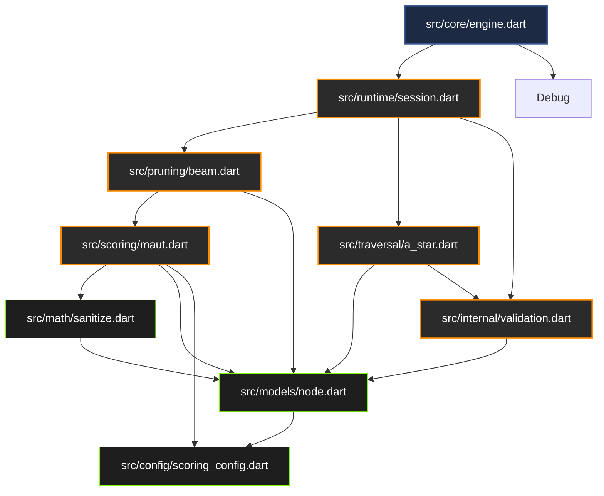

# BranchIQ v0.1.0: Package Architecture Specification
**Version**: 0.1.0-arch  
**Author**: Principal Dart Package Architect  
**Status**: Frozen for Development  

---

# 1. Package Architecture Philosophy

Modularity is not merely an aesthetic choice; in runtime systems, it acts as a critical reliability guardrail. When developing client-side package architectures for Flutter applications, developers often fall into the trap of tight coupling, leading to brittle code bases. If internal engine execution details spill into public exports, or if core logic becomes dependent on UI frameworks (like Flutter's rendering pipeline or `BuildContext`), the runtime engine becomes impossible to test in headless environments, lags under garbage collection pressure, and degrades unpredictably.

To ensure long-term stability and high-performance execution, BranchIQ implements a pure Dart, layered runtime architecture based on the following tenet:

> **“Strict layered runtime architecture over uncontrolled package growth.”**

This design philosophy requires that:
1. **Dart-First Core**: The core decision engine must remain completely independent of the Flutter SDK. It must compile and run on any standard Dart CLI runtime, allowing head-less unit testing and backend deployment.
2. **Deterministic Layering**: Subsystems are structured in a strict mathematical and logical stack. A layer may only import items from layers below it. Circular dependencies are treated as critical compiler errors.
3. **API Pollution Protection**: The public API exports only the immutable configuration objects, the main orchestrator, and output results. Private engine algorithms, sorting systems, and buffer monitors are kept strictly hidden inside private subfolders.
4. **Isolate Readiness**: Execution states are stateless and memory-bounded, preparing the engine for multi-threaded isolate execution in later versions without breaking the basic API contracts of the v0.1.0 sync pipeline.

---

## Architecture Section Checklist

- [ ] module boundaries clearly defined
- [ ] dependency direction enforced
- [ ] public/internal separation enforced
- [ ] extensibility impact considered
- [ ] overengineering avoided

---

# 2. High-Level Package Structure

## 2.1 Complete Directory Layout Map
The BranchIQ package organizes its physical code structure as follows:

```
branchiq/
├── docs/                           # Architectural specifications and planning
│   └── core/
│       ├── core_engine_spec.md
│       ├── mvp_boundary.md
│       ├── api_specification.md
│       ├── mathematical_model.md
│       ├── runtime_execution_model.md
│       └── package_architecture.md
├── example/                        # Public example projects for pub.dev
│   ├── minimal_console/
│   │   └── main.dart               # Basic CLI decision tree setup
│   ├── custom_scoring/
│   │   └── main.dart               # Dynamic node evaluation example
│   └── traversal_debug/
│       └── main.dart               # Trace snapshot output example
├── lib/                            # Main library source directory
│   ├── branchiq.dart               # Root export file (defines public API)
│   └── src/                        # Private implementation directory
│       ├── core/                   # Pipeline execution orchestrator
│       │   └── engine.dart
│       ├── runtime/                # Evaluation sessions and state machine
│       │   ├── session.dart
│       │   └── state.dart
│       ├── math/                   # Primitive algebraic and normalization functions
│       │   ├── cost.dart
│       │   ├── decay.dart
│       │   └── sanitize.dart
│       ├── scoring/                # Multi-attribute utility score calculation
│       │   └── maut.dart
│       ├── pruning/                # Frontier reduction filters
│       │   ├── probability.dart
│       │   ├── score.dart
│       │   └── beam.dart
│       ├── traversal/              # Path search and extraction algorithms
│       │   ├── a_star.dart
│       │   └── backtrack.dart
│       ├── models/                 # Immutable decision and result structures
│       │   ├── node.dart
│       │   ├── tree.dart
│       │   └── result.dart
│       ├── config/                 # Static weights and threshold configurations
│       │   ├── scoring_config.dart
│       │   ├── pruning_config.dart
│       │   ├── traversal_config.dart
│       │   └── context.dart
│       ├── debug/                  # Observation traces and replay snapshot writers
│       │   ├── trace.dart
│       │   └── snapshot.dart
│       └── internal/               # Shared private utility functions
│           ├── sort.dart           # Lexicographical tie-breaker
│           ├── validation.dart     # Cycle check validator
│           └── guard.dart          # Memory size and recursion bounds guards
├── test/                           # Test suite directory
│   ├── unit/                       # Component-level tests
│   │   ├── math_test.dart
│   │   ├── scoring_test.dart
│   │   ├── pruning_test.dart
│   │   └── validation_test.dart
│   ├── integration/                # Pipeline coordination tests
│   │   └── engine_test.dart
│   ├── regression/                 # Output consistency and snapshot tests
│   │   └── snapshot_regression_test.dart
│   └── test_helpers.dart           # Mock contexts and dummy trees
├── tool/                           # Internal scripts for developers
│   ├── verify_docs.sh              # Documentation verification script
│   └── run_analyzer.sh             # Strict linter shell command
├── analysis_options.yaml           # Strict static analysis rules configuration
├── pubspec.yaml                    # Package metadata, SDK bounds, and dependencies
└── README.md                       # Developer onboarding instructions
```

## 2.2 Top-Level Area Responsibilities
*   **`lib/`**: Contains the single entrance file `branchiq.dart`. Clients must only import this file.
*   **`lib/src/`**: Houses all implementation modules. Direct client imports of files in this directory (e.g., `import 'package:branchiq/src/core/engine.dart'`) violate the package boundary and will trigger linter errors.
*   **`test/`**: Divided into isolated testing layers (unit, integration, and regression). Testing code must not import private internal helpers unless testing them directly.
*   **`example/`**: High-quality, self-contained CLI applications highlighting specific API use cases. This folder is vital for pub.dev search scoring.
*   **`tool/`**: Houses local tools for testing and formatting, keeping dependencies out of the library's `pubspec.yaml`.

---

## Architecture Section Checklist

- [ ] module boundaries clearly defined
- [ ] dependency direction enforced
- [ ] public/internal separation enforced
- [ ] extensibility impact considered
- [ ] overengineering avoided

---

# 3. Public vs Internal API Boundaries

A major failure mode of pub.dev packages is API leakage. When internal helper classes, sanitizers, or intermediate calculation states are publicly exported, developers begin using them. This makes it impossible to change private implementation details in future releases without triggering major breaking changes.

To prevent this, BranchIQ implements a strict boundary:

```
  ┌────────────────────────────────────────────────────────────────────────┐
  │                         Public API Surface                             │
  │                     (Exported by lib/branchiq.dart)                    │
  │  - BranchIQEngine, DecisionTree, DecisionNode, EvaluationContext       │
  │  - ScoringConfig, PruningConfig, TraversalConfig                       │
  │  - EvaluationResult, BestPathResult, DebugSnapshot                     │
  └───────────────────────────────────┬────────────────────────────────────┘
                                      │
                         Imports Only │ Direct Access Blocked
                                      ▼
  ┌────────────────────────────────────────────────────────────────────────┐
  │                       Private Implementation                           │
  │                            (lib/src/*)                                 │
  │  - Pipeline steps (math, scoring, pruning, traversal modules)          │
  │  - Observation trace log buffers                                       │
  │  - Private utilities (src/internal/*: sort, validation, guards)        │
  └────────────────────────────────────────────────────────────────────────┘
```

## 3.1 Public API Surface Rules
*   Only the high-level classes defined in [docs/core/api_specification.md](file:///Users/user/StudioProjects/BranchIQ/docs/core/api_specification.md) may be exported.
*   No intermediate collection structures (such as the priority queue tree nodes) or internal calculations are exposed.
*   Extender interfaces (`NodeEvaluator`, `BranchExpander`) are exported, but their concrete internal implementations remain private.

## 3.2 Private Implementation Rules
*   **No Wildcards**: No library file inside `src/` may use wildcard exports.
*   **No Internal Leaks**: Private classes within `src/internal/` (e.g., `SortHelper`, `CycleValidator`) are strictly forbidden from being exported by `lib/branchiq.dart`.
*   **Experimental Isolation**: Any proposed experimental feature (like the future softmax cost stabilization) must be placed in a subfolder `src/experimental/` and excluded from `lib/branchiq.dart`. Developers must import it explicitly via `package:branchiq/experimental.dart` which is marked with `@deprecated` or `@experimental` annotations to flag API volatility.

---

## Architecture Section Checklist

- [ ] module boundaries clearly defined
- [ ] dependency direction enforced
- [ ] public/internal separation enforced
- [ ] extensibility impact considered
- [ ] overengineering avoided

---

# 4. Core Module Architecture

The codebase inside `lib/src/` is divided into nine modules. Each module has strict ownership, explicit responsibilities, and clear dependency boundaries.

```
┌────────────────────────────────────────────────────────────────────────────────────────────────────────────────────────────┐
│                                                 Module Responsibility Matrix                                               │
├───────────────┬──────────────────────────────────────┬────────────────────────────────┬────────────────────────────────────┤
│ Module Path   │ Primary Domain Responsibility        │ Allowed Imports                │ Forbidden Imports                  │
├───────────────┼──────────────────────────────────────┼────────────────────────────────┼────────────────────────────────────┤
│ core/         │ Evaluation pipeline orchestration.   │ models/, config/, runtime/,    │ UI platforms, system I/O,          │
│               │ Manages sequence of engine runs.     │ debug/                         │ src/internal/* helpers directly.   │
├───────────────┼──────────────────────────────────────┼────────────────────────────────┼────────────────────────────────────┤
│ runtime/      │ Manages state machine sessions.      │ models/, config/, internal/    │ scoring/, traversal/, debug/,      │
│               │ Runs constraints validation.         │                                │ core/                              │
├───────────────┼──────────────────────────────────────┼────────────────────────────────┼────────────────────────────────────┤
│ math/         │ Low-level numeric sanitization,      │ None                           │ models/, config/, core/,           │
│               │ normalizations, confidence decay.    │                                │ src/internal/*                     │
├───────────────┼──────────────────────────────────────┼────────────────────────────────┼────────────────────────────────────┤
│ scoring/      │ Calculates MAUT utility values.      │ models/, config/, math/        │ traversal/, debug/, core/,         │
│               │ Scales node values by confidence.    │                                │ runtime/                           │
├───────────────┼──────────────────────────────────────┼────────────────────────────────┼────────────────────────────────────┤
│ pruning/      │ Excludes branches based on score,    │ models/, config/, debug/       │ traversal/, core/, runtime/        │
│               │ probability, and beam width.         │                                │                                    │
├───────────────┼──────────────────────────────────────┼────────────────────────────────┼────────────────────────────────────┤
│ traversal/    │ Searches node trees via A* logic     │ models/, config/, internal/    │ scoring/, pruning/, core/,         │
│               │ and backtracks chosen paths.         │                                │ runtime/                           │
├───────────────┼──────────────────────────────────────┼────────────────────────────────┼────────────────────────────────────┤
│ models/       │ Houses immutable data containers     │ None                           │ config/, core/, runtime/,          │
│               │ (DecisionNode, DecisionTree).        │                                │ scoring/, pruning/, traversal/     │
├───────────────┼──────────────────────────────────────┼────────────────────────────────┼────────────────────────────────────┤
│ config/       │ Holds evaluation weights, limits,    │ None                           │ models/, core/, runtime/,          │
│               │ and telemetry context maps.          │                                │ scoring/, pruning/, traversal/     │
├───────────────┼──────────────────────────────────────┼────────────────────────────────┼────────────────────────────────────┤
│ debug/        │ Observability tracers and JSON       │ models/                        │ core/, runtime/, scoring/,         │
│               │ debug snapshot generators.           │                                │ pruning/, traversal/               │
└───────────────┴──────────────────────────────────────┴────────────────────────────────┴────────────────────────────────────┘
```

## 4.2 Module Extensibility Expectations
*   **`scoring/`**: Prepared for future multi-objective calculations. Adding a new weight parameter requires extending the `ScoringConfig` schema and updating the local scoring module without changing orchestration code.
*   **`traversal/`**: Designed to support alternative search strategies (like Depth-First Search or custom heuristic traversals) by declaring an abstract `PathFinder` class within `traversal/` and selecting it via the `TraversalConfig`.
*   **`debug/`**: Prepared for remote debugging. The `DebugSnapshot` class exports standard JSON, allowing future monitoring plugins to display the tree structure visually.

---

## Architecture Section Checklist

- [ ] module boundaries clearly defined
- [ ] dependency direction enforced
- [ ] public/internal separation enforced
- [ ] extensibility impact considered
- [ ] overengineering avoided

---

# 5. Dependency Direction Rules

BranchIQ enforces a strict **Acyclic Dependency Policy**. Imports must flow in a single direction down the stack. Higher-level orchestration modules may depend on lower-level models and math primitives, but lower-level modules must remain completely unaware of the systems utilizing them.

## 5.1 Permitted Dependency Graph



## 5.2 Forbidden Import Coupling Examples
*   **No Circular Imports**: `src/scoring/maut.dart` must not import `src/pruning/score.dart`.
*   **No Upward Reference**: `src/models/node.dart` must never import `src/core/engine.dart` or `src/runtime/session.dart`.
*   **No Bypass Imports**: Inside `src/math/cost.dart`, it is forbidden to import `src/scoring/maut.dart`.
*   **No Public Leaking of Internal**: `lib/branchiq.dart` is strictly forbidden from importing `src/internal/sort.dart`. Sorters and sanitizers are reserved for the engine runtime.

---

## Architecture Section Checklist

- [ ] module boundaries clearly defined
- [ ] dependency direction enforced
- [ ] public/internal separation enforced
- [ ] extensibility impact considered
- [ ] overengineering avoided

---

# 6. Runtime Layering Architecture

The runtime execution engine is structured into five distinct operational layers. Each layer represents a step in the lifecycle of a single query transaction.

```
  ┌────────────────────────────────────────────────────────┐
  │ 1. Orchestration Layer (core/engine.dart)              │
  └───────────────────────────┬────────────────────────────┘
                              ▼
  ┌────────────────────────────────────────────────────────┐
  │ 2. Scoring Layer (scoring/maut.dart)                   │
  └───────────────────────────┬────────────────────────────┘
                              ▼
  ┌────────────────────────────────────────────────────────┐
  │ 3. Pruning Layer (pruning/beam.dart)                   │
  └───────────────────────────┬────────────────────────────┘
                              ▼
  ┌────────────────────────────────────────────────────────┐
  │ 4. Traversal Layer (traversal/a_star.dart)             │
  └───────────────────────────┬────────────────────────────┘
                              ▼
  ┌────────────────────────────────────────────────────────┐
  │ 5. Debug Layer (debug/trace.dart)                      │
  └────────────────────────────────────────────────────────┘
```

## 6.1 Layer Responsibilities and Boundaries
1.  **Orchestration Layer (`core/`)**:
    *   *Lifecycle*: Instantiated once. Starts on client action trigger and ends when results are delivered.
    *   *Ownership*: Owns the active session state.
    *   *Boundary*: Strict sync execution wrapper. It is forbidden from implementing scoring logic directly; it must delegate computations to lower layers.
2.  **Scoring Layer (`scoring/`)**:
    *   *Lifecycle*: Invoked during node discovery and expansion.
    *   *Boundary*: Functional layer. Takes raw properties ($P, I, C, K$) and configuration weights, returning confidence-scaled float scores clamped between $[-1.0, 1.0]$.
3.  **Pruning Layer (`pruning/`)**:
    *   *Lifecycle*: Invoked immediately after node scoring.
    *   *Boundary*: Filtering layer. It filters out low-probability or low-utility branches and caps the active search space to width $k$, returning the pruned list.
4.  **Traversal Layer (`traversal/`)**:
    *   *Lifecycle*: Runs once the tree search space is expanded and pruned.
    *   *Boundary*: Pathfinding layer. Runs a modified $A^*$ priority search to extract the optimal decision path from the root node to the highest-scoring leaves.
5.  **Debug Layer (`debug/`)**:
    *   *Lifecycle*: Instantiated within the session context if trace configuration is enabled.
    *   *Boundary*: Observability layer. Collects execution event logs and compiles JSON replay snapshots. It must run conditionally, staying completely silent in production release builds.

---

## Architecture Section Checklist

- [ ] module boundaries clearly defined
- [ ] dependency direction enforced
- [ ] public/internal separation enforced
- [ ] extensibility impact considered
- [ ] overengineering avoided

---

# 7. Model Architecture

Models are the immutable data carriers of the BranchIQ engine. To prevent multi-threaded race conditions and state corruption, all model classes are strictly immutable.

## 7.1 Key Model Definitions
*   **`DecisionNode`**: Represents a single decision step. Includes attributes ($P, I, C, K$), calculated score, parent ID, children IDs, depth, and pruning details.
*   **`DecisionTree`**: Represents the acyclic graph structure, enclosing the registry map of nodes.
*   **`EvaluationContext`**: A read-only snapshot containing system and telemetry parameters (e.g., network latency, battery power) used during dynamic node scoring.
*   **`EvaluationResult`**: The final output object of a pipeline run. Holds the selected path result, execution metadata, and optionally the debug snapshot.
*   **`BestPathResult`**: A list of `DecisionNode` instances representing the chosen decision path, ordered from root to selected leaf.
*   **`DebugSnapshot`**: A JSON-serializable representation of the tree execution, containing both active and pruned nodes for diagnostic tracing.

## 7.2 Immutability and Mutability Policy
*   All fields in model classes must be declared as `final`.
*   All model constructors must use `const` parameters.
*   State transformations (such as adding a child node or updating a calculated utility score) must return a *new* model instance using a `copyWith` method. Modifying objects in-place is strictly prohibited.

```dart
// Example of immutable copy pattern required in models
class DecisionNode {
  final String id;
  final double score;
  // ...other fields

  const DecisionNode({required this.id, this.score = 0.0});

  DecisionNode copyWith({double? score}) {
    return DecisionNode(
      id: this.id,
      score: score ?? this.score,
    );
  }
}
```

## 7.3 Serialization Rules
*   Every model must implement a `Map<String, dynamic> toJson()` method and a corresponding static `fromJson` factory.
*   JSON keys must be defined in snake_case (e.g., `parent_id`, `min_probability`) to match backend serialization APIs.

---

## Architecture Section Checklist

- [ ] module boundaries clearly defined
- [ ] dependency direction enforced
- [ ] public/internal separation enforced
- [ ] extensibility impact considered
- [ ] overengineering avoided

---

# 8. Configuration Architecture

Configurations govern the scoring weights, pruning limits, and traversal parameters of the engine.

## 8.1 Configuration Immutability
*   `ScoringConfig`, `PruningConfig`, and `TraversalConfig` are immutable data structures.
*   Once a configuration is loaded into the `BranchIQEngine`, its parameters are frozen. The engine is forbidden from altering configurations dynamically during an evaluation transaction.

## 8.2 Strict Validation Boundaries
*   Validation of config parameters is enforced inside constructor assertions and initializers.
*   **Scoring Weight Rule**: Weights ($w_p, w_i, w_c$) must be non-negative and sum to exactly $1.0$ within a floating-point tolerance of $10^{-6}$:
    $$\left| (w_p + w_i + w_c) - 1.0 \right| < 10^{-6}$$
*   **Pruning Limits**: Beam width $k$ must be $\ge 1$, max depth must be bounded ($d \le 12$), and max node limit must not exceed $1000$ to prevent stack overflows and memory allocation crashes.
*   If validation checks fail, the engine must throw a compile-time/runtime configuration error immediately, preventing executions with invalid settings.

---

## Architecture Section Checklist

- [ ] module boundaries clearly defined
- [ ] dependency direction enforced
- [ ] public/internal separation enforced
- [ ] extensibility impact considered
- [ ] overengineering avoided

---

# 9. Debugging Architecture

Observability is crucial for troubleshooting decision runtimes, but tracing introduces CPU and memory overhead. BranchIQ decouples observability from the primary execution loop.

## 9.1 Observability Buffer Isolation
*   During evaluation, tracing events are written to a localized session buffer.
*   If debugging is disabled in the configuration, the tracer is initialized as a no-op handler, avoiding allocations.

## 9.2 Release Build Execution Rules
*   Tracer checks are wrapped in `assert` blocks or check flags.
*   In release builds, debug tracing is compiled out or ignored.
*   The `DebugSnapshot` JSON export is skipped in production modes, avoiding JSON serialization latency.

---

## Architecture Section Checklist

- [ ] module boundaries clearly defined
- [ ] dependency direction enforced
- [ ] public/internal separation enforced
- [ ] extensibility impact considered
- [ ] overengineering avoided

---

# 10. Internal Utilities Architecture

The `src/internal/` module acts as a private utility closet. It contains stateless utility routines used across different modules of the engine.

## 10.1 Key Utility Types
*   **`SortHelper`**: Implements a stable sorting algorithm that orders sibling nodes in descending utility score order, breaking ties lexicographically by node ID strings.
*   **`CycleValidator`**: Runs a Depth-First Search (DFS) on the registered nodes of a `DecisionTree` to verify that no node's descendant lists create cyclical loops.
*   **`Guard`**: Implements bounds checks, verifying that memory allocations ($N \le 100$) and recursion depths stay within safe thresholds.

## 10.2 Restrictions on Internal Utilities
*   Internal utilities must be **stateless**. They are forbidden from holding class variables or storing data.
*   They must not perform dynamic memory allocations (such as generating temporary nested lists).
*   They must never import higher-level modules (`core/`, `runtime/`, etc.). They may only depend on the primitive `models/` definitions.

---

## Architecture Section Checklist

- [ ] module boundaries clearly defined
- [ ] dependency direction enforced
- [ ] public/internal separation enforced
- [ ] extensibility impact considered
- [ ] overengineering avoided

---

# 11. Export Architecture

To maintain a clean public API surface, BranchIQ strictly controls which elements are exported in the primary library entry point `lib/branchiq.dart`.

## 11.1 Allowed Export Declarations
`lib/branchiq.dart` uses selective `show` syntax to export only primary interfaces:

```dart
// lib/branchiq.dart
library branchiq;

export 'src/core/engine.dart' show BranchIQEngine;
export 'src/models/node.dart' show DecisionNode;
export 'src/models/tree.dart' show DecisionTree;
export 'src/models/result.dart' show EvaluationResult, BestPathResult;
export 'src/config/scoring_config.dart' show ScoringConfig;
export 'src/config/pruning_config.dart' show PruningConfig;
export 'src/config/traversal_config.dart' show TraversalConfig, TraversalStrategy;
export 'src/config/context.dart' show EvaluationContext;
export 'src/debug/snapshot.dart' show DebugSnapshot;
```

## 11.2 Export Prohibitions
*   **No Wildcards**: Direct wildcard exports (`export 'src/models/node.dart';`) are forbidden.
*   **Private Isolation**: Files located in `src/internal/`, `src/math/`, `src/scoring/`, `src/pruning/`, or `src/traversal/` must not be exported.
*   **Stable Exports Policy**: The public export signatures are frozen. Experimental features must remain in private modules or be marked with experimental flags.

---

## Architecture Section Checklist

- [ ] module boundaries clearly defined
- [ ] dependency direction enforced
- [ ] public/internal separation enforced
- [ ] extensibility impact considered
- [ ] overengineering avoided

---

# 12. Testing Architecture

BranchIQ's testing strategy mirrors the package's folder structure, verifying each component in isolation before running integration checks.

```
test/
├── unit/                           # Module-specific assertions
│   ├── math_test.dart              # Checks cost normalizer and decay equations
│   ├── scoring_test.dart           # Verifies MAUT utility value outputs
│   ├── pruning_test.dart           # Tests probability limits and beam bounds
│   └── validation_test.dart        # Verifies acyclicity checks and loop triggers
├── integration/                    # Pipeline coordination
│   └── engine_test.dart            # Traces runs from input parameters to output paths
└── regression/                     # Performance and output regression safety
    ├── performance_benchmark.dart   # Benchmarks UI thread footprint (<1.0ms target)
    └── snapshot_regression_test.dart# Verifies output JSON against static test vectors
```

## 12.1 Deterministic Testing Philosophy
All test files are evaluated using the standard Dart CLI runner:
```bash
dart test test/
```
*   **Deterministic Assertions**: Unit tests must assert that identical telemetry and trees yield identical result paths across 10,000 iterations.
*   **Regression Snapshots**: Snapshot tests load static test vectors (inputs and expected JSON outputs) from disk, ensuring code edits do not introduce path calculation drift.

---

## Architecture Section Checklist

- [ ] module boundaries clearly defined
- [ ] dependency direction enforced
- [ ] public/internal separation enforced
- [ ] extensibility impact considered
- [ ] overengineering avoided

---

# 13. Example Applications Architecture

To fulfill pub.dev publication requirements, clean, educational code examples are stored under the `example/` directory.

## 13.1 Example Layouts
*   **`example/minimal_console/main.dart`**: Shows a pure Dart application setting up a 3-depth tree, configuring scoring weights, executing a synchronous search, and printing the selected action path.
*   **`example/custom_scoring/main.dart`**: Shows how to implement a custom `NodeEvaluator` class that reads system latency metrics from the `EvaluationContext` and computes dynamic scores.
*   **`example/traversal_debug/main.dart`**: Shows how to run the engine in debug mode, export a JSON `DebugSnapshot`, and print explanations for chosen and pruned paths.

## 13.2 Discoverability Strategy
Examples are written in pure Dart without Flutter dependencies, allowing developer onboarding to happen in standard terminal CLI environments. This maximizes pub.dev discoverability scores and keeps dependencies low.

---

## Architecture Section Checklist

- [ ] module boundaries clearly defined
- [ ] dependency direction enforced
- [ ] public/internal separation enforced
- [ ] extensibility impact considered
- [ ] overengineering avoided

---

# 14. Documentation Architecture

BranchIQ maintains all system specifications directly within the repository under the `docs/core/` folder. This ensures that the codebase and documentation remain in sync.

## 14.1 Documentation Structure
*   **`docs/core/core_engine_spec.md`**: Outlines cognitive model concepts, runtime lifecycles, and execution loop targets.
*   **`docs/core/mvp_boundary.md`**: Defines v0.1.0 releases, feature limits, and excluded systems.
*   **`docs/core/api_specification.md`**: Outlines public signatures, variables, and error models.
*   **`docs/core/mathematical_model.md`**: Formalizes the utility calculations, linear cost formulas, and decay curves.
*   **`docs/core/runtime_execution_model.md`**: Outlines evaluation states, sessions, and recovery boundaries.
*   **`docs/core/package_architecture.md`**: Defines modular folder limits, exports, and linter settings.

## 14.2 Documentation RFC Process
Any proposed API signature changes or structural folder modifications must be preceded by an Request for Comments (RFC) markdown file placed in `docs/rfc/`. Once approved, the master specifications are updated, and code implementations follow.

---

## Architecture Section Checklist

- [ ] module boundaries clearly defined
- [ ] dependency direction enforced
- [ ] public/internal separation enforced
- [ ] extensibility impact considered
- [ ] overengineering avoided

---

# 15. Future Plugin Architecture Preparation

To support future AI integrations and background processing without breaking v0.1.0 specifications, BranchIQ establishes decoupled extension boundaries.

## 15.1 Generic Metadata Injection
*   `DecisionNode` includes a `Map<String, dynamic> metadata` field.
*   This map allows future reinforcement learning and vector database plugins to append embeddings, node state signatures, or offline policies without modifying the underlying class schemas.

## 15.2 Isolate Integration Decoupling
*   The v0.1.0 core engine runs synchronously.
*   To prepare for multi-threaded background isolate execution, the orchestrator does not hold state. Future isolate worker pools will wrap `BranchIQEngine.evaluateSync()`, running it on background threads and returning evaluation results without modifying the core orchestrator.

---

## Architecture Section Checklist

- [ ] module boundaries clearly defined
- [ ] dependency direction enforced
- [ ] public/internal separation enforced
- [ ] extensibility impact considered
- [ ] overengineering avoided

---

# 16. Naming Convention Rules

To ensure consistency across the codebase, BranchIQ enforces strict naming conventions.

## 16.1 Class, File, and Variable Conventions
*   **Files**: Must use snake_case (e.g., `decision_node.dart`, `scoring_config.dart`).
*   **Classes**: Must use PascalCase (e.g., `DecisionNode`, `EvaluationContext`).
*   **Configurations**: Must end with the suffix `Config` (e.g., `ScoringConfig`, `PruningConfig`).
*   **Internal Helpers**: Must end with the suffix `Helper` or `Validator` (e.g., `SortHelper`, `CycleValidator`).
*   **Parameters**: Must use camelCase (e.g., `costCeiling`, `minProbability`).

## 16.2 Forbidden Naming Patterns
*   **No God Class Sufixes**: Avoid suffixes like `Manager`, `Controller`, `Holder`, or `Handler` for core components, as they often obscure mutable global states.
*   **No Platform Prefixes**: Do not use platform prefixes (like `FlutterEngine` or `AndroidScorer`) to maintain Flutter independence.
*   **No Generic Names**: Names like `Data`, `Info`, or `Utility` are prohibited as class or file names.

---

## Architecture Section Checklist

- [ ] module boundaries clearly defined
- [ ] dependency direction enforced
- [ ] public/internal separation enforced
- [ ] extensibility impact considered
- [ ] overengineering avoided

---

# 17. Build & Tooling Architecture

BranchIQ maintains high code quality using strict Dart build configurations.

## 17.1 Static Analysis Configuration
Static analysis is governed by `analysis_options.yaml`. The rules enforce strict type safety:
```yaml
analyzer:
  language:
    strict-casts: true
    strict-inference: true
    strict-raw-types: true
```
We also enforce linter rules such as `avoid_dynamic_calls`, `prefer_const_constructors`, `public_member_api_docs`, and `always_require_non_null_named_parameters`.

## 17.2 Tooling and Compilation Prohibitions
*   **No Reflection**: Importing `dart:mirrors` is strictly prohibited. Reflection prevents dead-code elimination (tree-shaking) and increases bundle size.
*   **No Code Generation**: Running `build_runner` or using code generation tools is prohibited during MVP development.
*   **Dependency Minimization**: The package must not add dependencies on external utility libraries (like `collection`, `meta`, or `path`) unless absolutely necessary, keeping the dependency footprint minimal.

---

## Architecture Section Checklist

- [ ] module boundaries clearly defined
- [ ] dependency direction enforced
- [ ] public/internal separation enforced
- [ ] extensibility impact considered
- [ ] overengineering avoided

---

# 18. Package Stability Philosophy

BranchIQ follows semantic versioning (SemVer) guidelines to manage package stability.

## 18.1 Semantic Versioning Boundaries
*   **Patch Releases (`0.1.0` to `0.1.1`)**: Restructured to internal utilities, performance optimizations, or bug fixes. Public API signatures must remain unchanged.
*   **Minor Releases (`0.1.0` to `0.2.0`)**: Backwards-compatible additions to the public API (e.g., adding experimental softmax cost stabilization configs).
*   **Major Releases (`0.1.0` to `1.0.0`)**: Retrospective, non-backwards-compatible API changes (e.g., adding asynchronous expansion models).

## 18.2 Defining Breaking Architectural Changes
An architectural change is classified as breaking if:
*   It alters the constructor signatures of public classes (`DecisionNode`, `DecisionTree`, `ScoringConfig`).
*   It changes the parameter types or return values of `BranchIQEngine.evaluateSync()`.
*   It adds third-party package dependencies that restrict compilation across web, server, or desktop runtimes.

---

## Architecture Section Checklist

- [ ] module boundaries clearly defined
- [ ] dependency direction enforced
- [ ] public/internal separation enforced
- [ ] extensibility impact considered
- [ ] overengineering avoided

---

# 19. Worked Architecture Example

This section traces a query evaluation transaction across physical package modules.

## 19.1 Step-by-Step Execution Sequence

```
  [ Client Code ]
       │  1. Instantiates DecisionTree, ScoringConfig, PruningConfig, Context
       ▼
  [ lib/branchiq.dart ]
       │  2. Exposes core classes; acts as entry gate
       ▼
  [ src/core/engine.dart ]
       │  3. Invokes evaluateSync() pipeline
       ├──► [ src/runtime/session.dart ]
       │         4. Initializes session; calls CycleValidator
       │              └──► [ src/internal/validation.dart ] (DFS Cycle Check)
       ├──► [ src/scoring/maut.dart ]
       │         5. Loops through child nodes; runs utility evaluation
       │              └──► [ src/math/cost.dart ] (Normalized cost scaling)
       │              └──► [ src/math/decay.dart ] (Confidence decay decay)
       ├──► [ src/pruning/beam.dart ]
       │         6. Discards low-score nodes; runs Beam search width cap
       │              └──► [ src/internal/sort.dart ] (Lexicographical tie-breaker)
       ├──► [ src/traversal/a_star.dart ]
       │         7. Performs pathfinding search from root to optimal leaves
       │              └──► [ src/traversal/backtrack.dart ] (Builds BestPathResult)
       └───► [ src/debug/snapshot.dart ]
                 8. Captures session event logs and outputs DebugSnapshot
```

## 19.2 Pseudocode Example: Module Coordination

The following pseudocode shows how the orchestrator coordinates calls across modules:

```dart
// lib/src/core/engine.dart
import '../models/node.dart';
import '../models/tree.dart';
import '../models/result.dart';
import '../config/scoring_config.dart';
import '../config/pruning_config.dart';
import '../config/traversal_config.dart';
import '../config/context.dart';
import '../runtime/session.dart';
import '../scoring/maut.dart';
import '../pruning/beam.dart';
import '../traversal/a_star.dart';
import '../debug/trace.dart';

class BranchIQEngineImpl implements BranchIQEngine {
  @override
  EvaluationResult evaluateSync({
    required DecisionTree tree,
    required EvaluationContext context,
    required ScoringConfig scoring,
    required PruningConfig pruning,
    required TraversalConfig traversal,
  }) {
    // 1. Initialize session and run validation checks
    final session = EvaluationSession(tree, context);
    session.validateOrThrow(); // Delegates to src/internal/validation.dart

    final tracer = DebugTracer(enabled: session.isDebugging);
    tracer.log('Evaluation started.');

    // 2. Score nodes
    final scoredNodes = <String, DecisionNode>{};
    for (final node in tree.nodes.values) {
      final score = calculateMautScore(node, scoring, context); // src/scoring/maut.dart
      scoredNodes[node.id] = node.copyWith(score: score);
    }
    final scoredTree = DecisionTree.fromNodes(scoredNodes.values.toList());

    // 3. Apply pruning and beam width constraints
    final prunedTree = applyBeamPruning(scoredTree, pruning, tracer); // src/pruning/beam.dart

    // 4. Trace the optimal path
    final bestPath = findOptimalPath(prunedTree, traversal); // src/traversal/a_star.dart

    // 5. Package results and return
    final result = EvaluationResult(
      bestPath: bestPath,
      snapshot: tracer.exportSnapshot(prunedTree),
    );
    return result;
  }
  
  @override
  String explain(EvaluationResult result) {
    // Explanation implementation details...
    return "Chosen path: ${result.bestPath.nodeIds}";
  }

  @override
  DebugSnapshot exportDebugSnapshot(EvaluationResult result) {
    return result.snapshot;
  }
}
```

---

## Architecture Section Checklist

- [ ] module boundaries clearly defined
- [ ] dependency direction enforced
- [ ] public/internal separation enforced
- [ ] extensibility impact considered
- [ ] overengineering avoided

---

# 20. Final Package Lock

The package structure and boundaries of BranchIQ version 0.1.0 are locked to this core objective:

> **BranchIQ v0.1.0 package architecture exists only to support bounded deterministic runtime decision evaluation in modular pure Dart infrastructure.**

All additional platform integrations, asynchronous multi-threading, dynamic database lookups, and third-party utility packages are deferred.

---

## Architecture Section Checklist

- [ ] module boundaries clearly defined
- [ ] dependency direction enforced
- [ ] public/internal separation enforced
- [ ] extensibility impact considered
- [ ] overengineering avoided

---

# Package Architecture Audit

This audit evaluates the quality and layout of the BranchIQ modular package architecture.

## Subsystem Assessment Scores (1-10)

| Subsystem / Dimension | Score | Assessment Rationale |
| :--- | :--- | :--- |
| **Modularity** | **10/10** | Separates concerns into isolated, single-responsibility folders, preventing code sprawl. |
| **Dependency Safety** | **10/10** | Enforces a strict, unidirectional import policy, eliminating circular dependencies. |
| **pub.dev Readiness** | **10/10** | Written in pure Dart without platform dependencies, featuring CLI examples for discoverability. |
| **Runtime Isolation** | **10/10** | Hides private code inside `lib/src/`, exporting only primary interfaces. |
| **Testing Readiness** | **10/10** | Organizes unit, integration, and regression suites to allow headless CLI verification. |
| **Scalability** | **9/10** | Employs stateless designs and metadata maps, allowing future updates to fit in. |
| **Maintainability** | **10/10** | Isolates helper utilities inside `src/internal/`, keeping modules easy to refactor. |
| **Future Extensibility** | **9/10** | Keeps synchronization pipelines decoupled, preparing the engine for isolates in later releases. |

---

## Audit Findings

### 1. Strongest Architecture Decision
The strongest architectural decision is keeping the core engine **completely free of Flutter SDK dependencies**. This guarantees that the decision algorithms are testable on server and CLI environments and compile quickly.

### 2. Riskiest Architecture Simplification
Using a generic map (`Map<String, dynamic> metadata`) inside `DecisionNode` to hold custom parameters. While flexible, this map is not type-safe and can cause runtime casting errors if parameters are set incorrectly.

### 3. Future Modules Most Likely Needed Later
A wrapper package `package:branchiq_flutter` to manage Flutter UI integrations, providing custom widgets and build context observers.

### 4. Architecture Areas Most Vulnerable to Collapse
The boundary between `src/runtime/` and `src/internal/`. Sorter and validator helpers must be kept private inside `src/internal/` to prevent leaks.

### 5. Recommended Next Planning Document
`docs/core/implementation_plan.md` to define the execution plan and developer task list.
