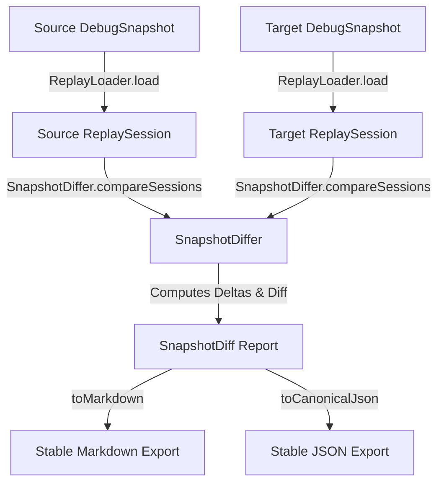

# Snapshot Diffing Guide

This guide describes the architecture, mechanics, delta formulas, and limitations of the deterministic **Snapshot Diffing Layer** in BranchIQ.

---

## Technical Architecture Overview

Snapshot Diffing operates strictly **offline, post-mortem, and synchronously**. It compares two previously recorded execution traces (`source` and `target`) using their raw `DebugSnapshot` configurations or `ReplaySession` data.

### Deterministic & Synchronous Guarantees
* **No Dynamic Engine Reruns**: The diffing layer operates without calling `BranchIQEngine.evaluateSync()`, performing score allocations, traversal algorithms, or pruning heuristics.
* **100% Deterministic**: All lists of added, removed, or modified node IDs are sorted lexicographically to enforce platform-independent, byte-identical output across systems.
* **Locale-Agnostic Floats**: Uses `CanonicalFloatFormatter` to format float deltas to exactly 4 decimal places.

---

## Comparison Mechanics & Deltas

### 1. Selected Path Changes
A path is flagged as changed (`pathChanged = true`) if:
* The length of the source selected path is different from the target selected path.
* Any node ID at the same position in both lists differs.

### 2. Utility Changes
The total utility represents the resolved score of the final terminal node in the selected pathway.
The delta is calculated strictly as:
$$\text{UtilityDelta} = \text{TargetUtility} - \text{SourceUtility}$$

### 3. Node Metric Changes
For any decision node that exists in either the source or the target, the diff engine tracks structural existence changes and calculates individual metric shifts:
* **Score Delta**: $\text{TargetScore} - \text{SourceScore}$
* **Probability Delta**: $\text{TargetProbability} - \text{SourceProbability}$
* **Impact Delta**: $\text{TargetImpact} - \text{SourceImpact}$
* **Cost Delta**: $\text{TargetCost} - \text{SourceCost}$
* **Confidence Delta**: $\text{TargetConfidence} - \text{SourceConfidence}$

If a metric is absent or null in either snapshot, the delta yields `null`, and the metric name is captured in the node's `changedFields` metadata list.

### 4. Pruning Changes
The diffing engine checks if a node's pruning status flipped:
* **Newly Pruned Node**: A node that was retained in the source snapshot but is now pruned in the target snapshot.
* **Newly Unpruned Node**: A node that was pruned in the source snapshot but is now retained in the target snapshot.

### 5. Chronological Trace Changes
Compares the chronological execution traces of both evaluations:
* **Source-Only Traces**: Execution logs present in the source but missing in the target, preserving source relative order.
* **Target-Only Traces**: Execution logs present in the target but missing in the source, preserving target relative order.
* **Shared Traces**: Logs present in both snapshots.

---

## 🚫 Non-AI and Causality Boundaries

> [!WARNING]
> **No Narrative Speculation**: BranchIQ does NOT perform natural language generation or attempt to "explain why" a metric changed. It presents purely observable, byte-level structural differences.
>
> **Correlation is Not Causality**: While a change in node scoring or cost correlates with a shift in pathway selection, the Snapshot Differ does not infer hidden causality, business rules, or psychological justifications. It details mathematical metrics only.
